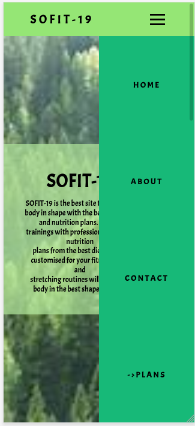

# *SOFIT-19*

SOFIT-19 is the best site to keep your body in shape with the best exercises and nutrition plans. Private trainings with professional trainers, nutrition plans from the best dietologists customised for your fitness goals and stretching routines will turn your body in the best shape possible.

## How to use the project?

Just visit [the live demo](https://nikitaprodanov.github.io/WEBDesignFinalProjecct/).

## Used technologies

All used technologies:
* [Gulp](https://gulpjs.com/)
* [Sass](https://sass-lang.com/)
* [Regular html, css and js](https://www.w3schools.com/whatis/default.asp)

## Dev stats:

## Repo stats:

